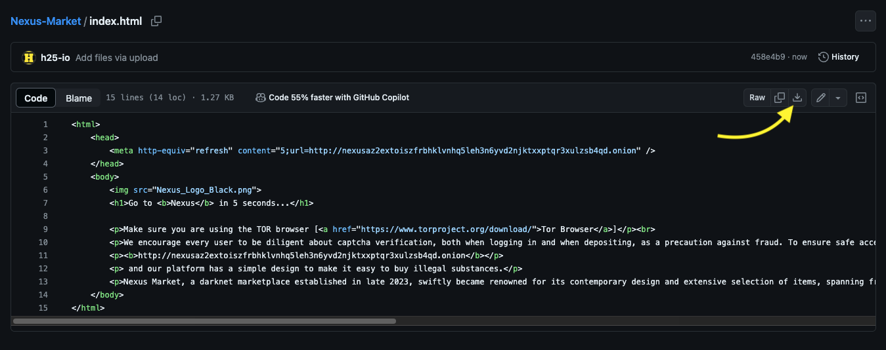
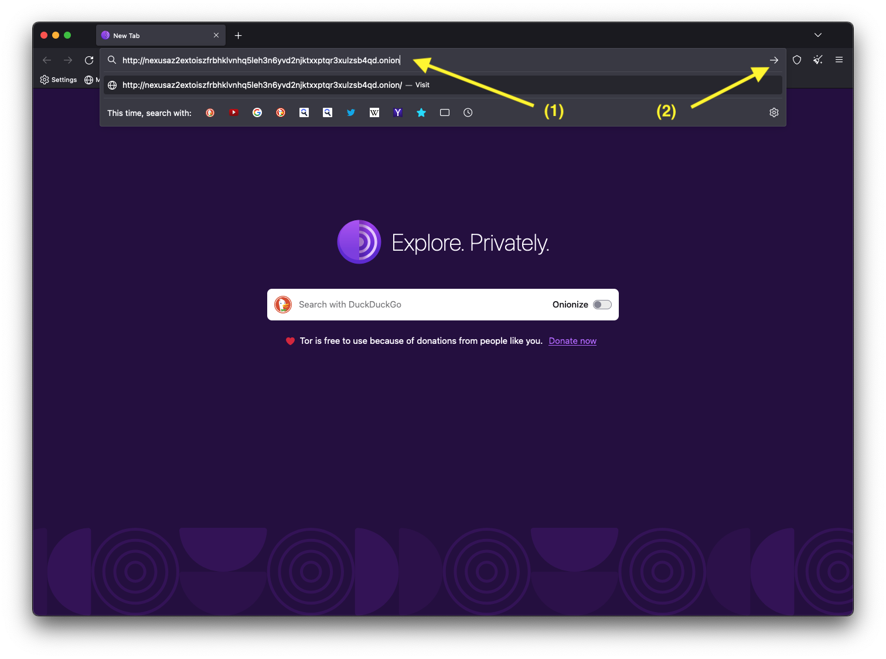

# Nexus Market Onion (TOR) Link
## [http://nexusaz2extoiszfrbhklvnhq5leh3n6yvd2njktxxptqr3xulzsb4qd.onion](http://nexusaz2extoiszfrbhklvnhq5leh3n6yvd2njktxxptqr3xulzsb4qd.onion?utm=nexusgithub)

To access Nexus, you need to do one of the following:
- Download the [index.html](index.html) file and open it in [Tor Browser](https://www.torproject.org/download/).
 .
- open this address [http://nexusaz2extoiszfrbhklvnhq5leh3n6yvd2njktxxptqr3xulzsb4qd.onion](http://nexusaz2extoiszfrbhklvnhq5leh3n6yvd2njktxxptqr3xulzsb4qd.onion?utm=nexusgithub) in [Tor Browser](https://www.torproject.org/download/).
 .

## Success!

 .

> information provided for research purposes by the [h25.io](https://h25.io/dark-web/nexus-market/) team.
